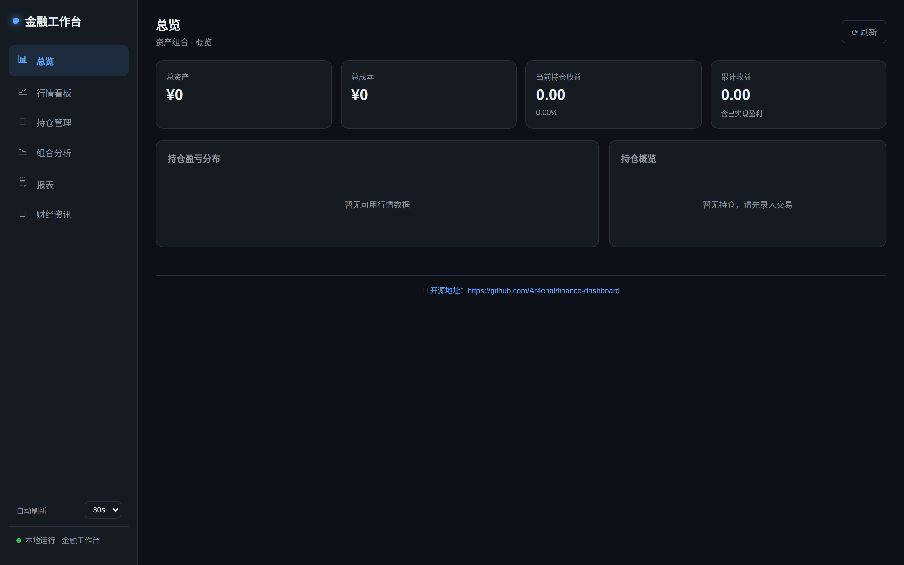
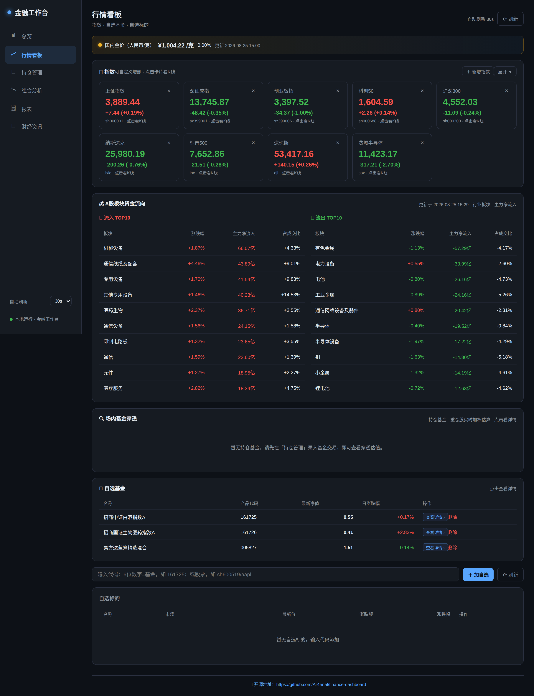
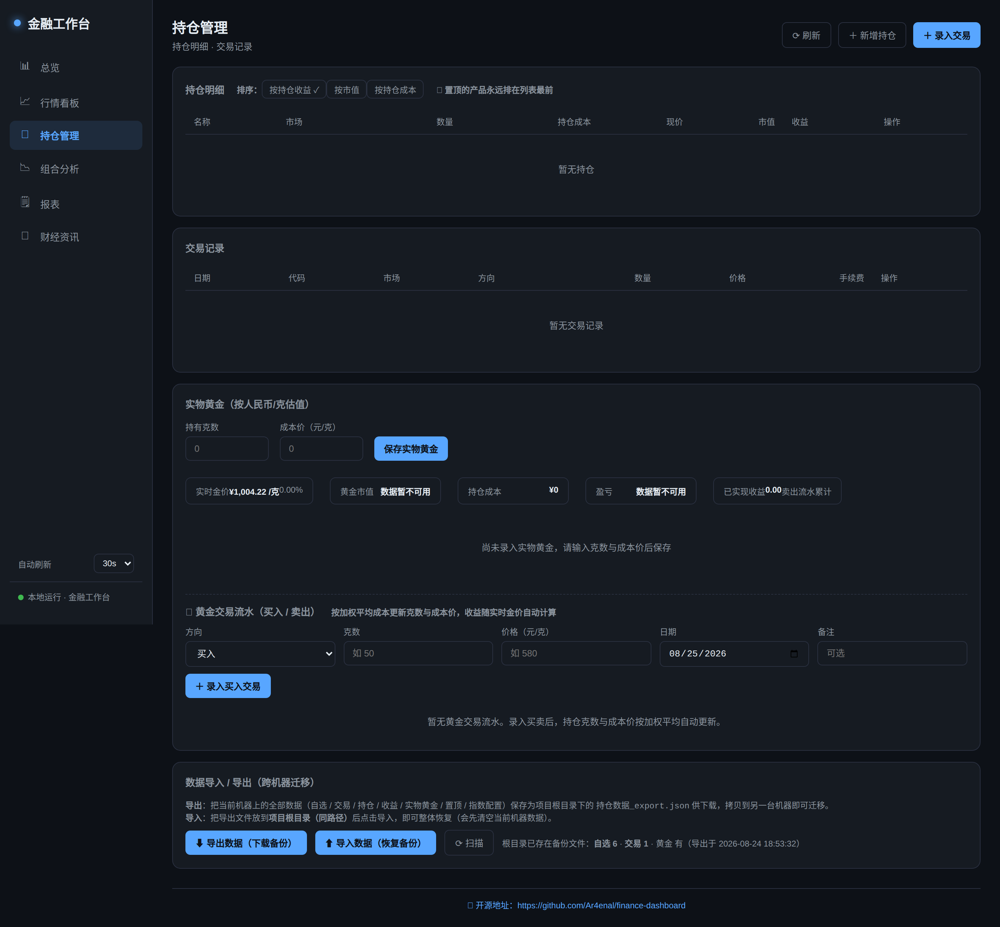
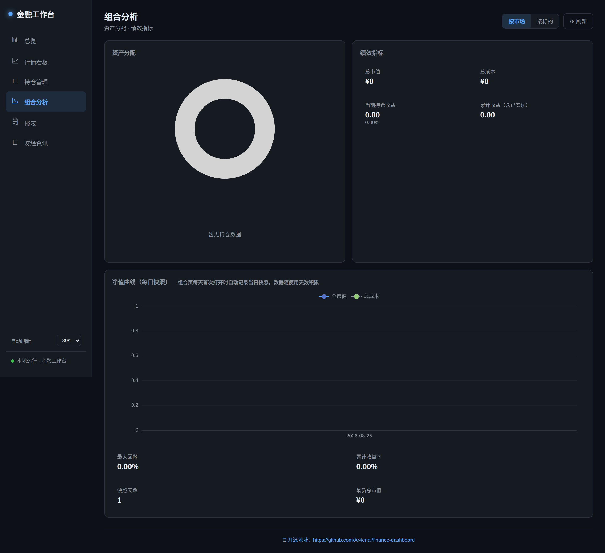
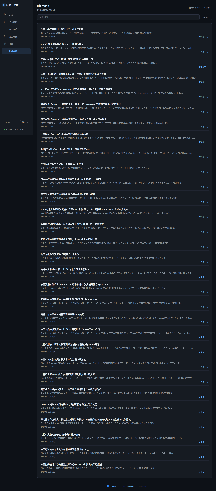

# 金融工作台 — 个人投资者投资记账与行情工具

> 适配你的环境：**Linux / Windows 双平台**（Python 3.7+，Linux 实测 3.7.3）。提供跨平台环境配置脚本，自动补装 venv 并安装最小依赖。Linux 用 `setup_env.sh` + `operation.sh`，Windows 用 `setup_env.bat` + `operation.bat`，两步启动。
>
> **业务定位**：投资/交易工作台 + 资产组合管理。**仅做记账和行情查看，不接券商真实下单。**

---

## 〇、功能一览

| 模块 | 说明 |
|---|---|
| 📊 行情看板 | **指数大字卡**（**用户可自定义增删**，首次启动预置 9 个国内外指数）、**A股板块资金流向**（**当天前十流入/流出**行业板块，东方财富真实数据）、**场内基金穿透**（位于指数与自选基金模块中间）、**自选基金小字列表**、每个基金可点进详情（净值+持仓分布+前十重仓近期行情）、**实时国内金价条**（人民币/克）、黄金细分（纽约金/沪金/伦敦金）、可转债、国内外指数自选 |
| 📈 K线 + 技术指标 | 日K/周K，MA5/10/20 + MACD(DIF/DEA/柱)，A股/美股/港股均可查看，**红涨绿跌**配色与全站一致 |
| 💼 持仓管理 | 买卖交易记录录入，**实物黄金克数与成本价编辑**（人民币/克，模块置于页面最下方），加权平均成本法自动聚合持仓，实时市值与盈亏；**默认按持仓收益排序**（可切换按市值 / 成本）、**置顶产品**（数量不限，后端持久化 + 跨机器迁移）、**每页 20 条翻页**；**实物黄金买卖流水每页 5 条** + 翻页 |
| 📊 组合分析 | 总市值/成本/盈亏（含实物黄金）、按市场/标的分配、净值曲线、最大回撤、累计收益 |
| 📄 报表 | 持仓（含实物黄金）与交易记录 CSV 导出 |
| 📰 财经资讯 | 新浪滚动财经新闻 |
| 🌐 市场覆盖 | A股/场内、美股、港股、黄金（纽约金/沪金/伦敦金）、**实物黄金**、公募基金、债券（可转债）、国内外指数 |
| 🔒 数据真实性 | **所有数据来自真实接口，获取失败明确提示"数据暂不可用"，绝不填充虚拟数据** |

**技术栈**：FastAPI + React + ECharts + SQLite，纯本地运行，单端口访问（默认 `http://localhost:8000`）。

## 界面预览

> 以下为 5 个代表性页面在 1440×900 分辨率下的真实截图（数据来自公开接口），点击图片可查看完整版本。

### 📊 总览 Dashboard


### 📈 行情看板（指数大字卡 · 板块资金流向 · 场内基金穿透 · 自选基金/标的）


### 💼 持仓管理（按收益排序 · 置顶 · 翻页 · 实物黄金流水 5 条/页 · 数据导入导出）


### 📉 组合分析（市值 · 成本 · 盈亏 · 净值曲线 · 最大回撤）


### 📰 财经资讯（新浪滚动新闻）


---

## 一、你需要准备

- **Linux**（Debian/Ubuntu 用 `apt`，CentOS/RHEL 用 `yum`，脚本自动识别）或 **Windows**（Windows 10/11，需支持 PowerShell）
- Python 3.7+（Linux 实测 **3.7.3**，Windows 建议 3.8+ 或 3.9+）
- 可访问互联网（行情/新闻来自公开接口）

---

## 二、三步启动

> 下方 **Linux** 与 **Windows** 二选一，按你的系统执行。

### 🐧 Linux 环境

#### 第 1 步：配置环境（只需一次）
```bash
cd <本项目目录>
bash setup_env.sh
```
脚本会依次完成（全程自动）：
1. 检测 Python 版本（需 ≥3.7）
2. 检测 pip，缺失则自动补装
3. **检测 venv，缺失则自动补装**（`apt install python3-venv`，装不上则回退 `virtualenv`）
4. 创建虚拟环境 `.venv`
5. 在虚拟环境内升级 pip
6. 安装最小依赖（锁定 Python 3.7 兼容版本）
7. 验证安装

> 脚本可重复运行，已存在 `.venv` 会跳过创建。

#### 第 2 步：启动应用
```bash
bash operation.sh start          # 启动，默认监听 0.0.0.0:8000
# 或指定端口：bash operation.sh start 9000
```
浏览器访问 **http://localhost:8000**

#### 第 3 步：启停管理
```bash
bash operation.sh start              # 启动后端（后台运行）
bash operation.sh stop               # 停止后端
bash operation.sh restart            # 重启后端
bash operation.sh restart 9000       # 重启并指定端口 9000
bash operation.sh status             # 查看运行状态
```
启动后进程在后台运行（日志写入 `.server.log`），无需一直占用终端窗口。

---

### 🪟 Windows 环境

> **前置**：安装 Python 3.7+（建议 3.8/3.9），安装时务必勾选 **"Add Python to PATH"**。下载：https://www.python.org/downloads/

#### 第 1 步：配置环境（只需一次）
双击运行 **`setup_env.bat`**（或命令行执行 `setup_env.bat`）。脚本会自动：
1. 定位并检测 Python（`python` 或 `py`，需 ≥3.7）
2. 创建虚拟环境 `.venv`
3. 升级 pip 并安装最小依赖（锁定 Python 3.7 兼容版本，失败自动切清华镜像）
4. 检测 node，有则构建前端；无则使用交付的 `frontend_dist` 构建产物
5. 校验前端产物

> 脚本可重复运行，已存在 `.venv` 会跳过创建。配置完成后窗口会显示提示。

#### 第 2 步：启动应用
双击运行 **`operation.bat`**（或命令行 `operation.bat`）。默认端口 **8000**，监听 `0.0.0.0` 可局域网访问。
- 指定端口：`operation.bat 9000`
- 浏览器访问 **http://localhost:8000**

启动成功后窗口会同时打印**本机访问地址**和**局域网访问地址**：
```
[start] 本机访问   → http://localhost:8000
[start] 局域网访问 → http://192.168.1.100:8000
```

#### 第 3 步：启停管理
```bat
operation.bat               启动后端（后台运行）
operation.bat stop          停止后端
operation.bat restart       重启后端
operation.bat 9000          启动并指定端口 9000
operation.bat status        查看运行状态
```
后端在后台运行（日志写入 `.server.log`），可随时关闭本窗口。

> 💡 **中文乱码处理**：若脚本输出中文乱码，请在 Windows 设置 → 时间和语言 → 语言 → 管理语言设置 → 更改系统区域设置中，勾选 **"Beta: 使用 Unicode UTF-8 提供全球语言支持"**，重启后即可正常显示。

---

## 三、局域网访问（其他终端 / 手机打开）

默认脚本监听 `0.0.0.0`，**同一局域网内的其他设备也能访问**，无需额外配置：

1. 启动应用：Linux 运行 `bash operation.sh start`，Windows 运行 `operation.bat`，记下打印的**局域网 IP 地址**（如 `192.168.1.100`）。
2. 在手机 / 其他电脑的浏览器打开：`http://192.168.1.100:8000`。
3. 若访问失败，按下面顺序排查：

| 情况 | 处理 |
|---|---|
| 网页打不开 | 确认两台设备在同一 Wi-Fi/网段（可用 `ping 局域网IP` 验证） |
| Linux 防火墙拦截 8000 端口 | 放行端口：`sudo ufw allow 8000/tcp`（Ubuntu）或 `sudo firewall-cmd --permanent --add-port=8000/tcp && sudo firewall-cmd --reload`（CentOS）；容器内需映射端口 |
| **Windows 防火墙拦截 8000 端口** | 首次启动会弹出防火墙提示，勾选"专用网络"并点击"允许访问"；若未弹窗，手动放行：控制面板 → Windows Defender 防火墙 → 高级设置 → 入站规则 → 新建规则 → 端口 → TCP 8000 → 允许连接 |
| 虚拟机中运行 | 虚拟机需用「桥接」或「NAT + 端口转发」，NAT 模式默认只能宿主机访问 |
| 只想本机访问 | Linux：`bash operation.sh restart 8000 127.0.0.1`；Windows：暂不支持关闭局域网（默认 0.0.0.0），可用防火墙仅允许本机 |

> 局域网访问共享的是**同一份数据与行情**，任意设备读写同一 SQLite 数据库。若同时多端操作，请勿并发写库（建议单端录入、多端查看）。

---

## 四、依赖清单（Python 3.7 兼容锁定）

见 `requirements.txt`。关键点：**FastAPI 最高兼容 py3.7 的版本是 0.99.1**（新版要求 ≥3.8），故已锁定。

| 包 | 锁定版本 | 用途 |
|---|---|---|
| fastapi | 0.99.1 | Web 框架（自动拉取配套 starlette 0.27.x） |
| uvicorn | 0.22.0 | ASGI 服务器 |
| pydantic | 1.10.14 | 数据校验（v1，匹配 fastapi 0.99.x 的 `<2.0` 约束） |
| requests | 2.31.0 | 行情/新闻请求 |

> ⚠️ 兼容性陷阱：fastapi 0.99.1 依赖 **pydantic v1（<2.0）**，不可用 pydantic v2；starlette 会自动匹配 0.27.x，无需也不应手动指定（手动指定 0.29.0 会冲突）。本脚本已在沙箱实测通过。

---

## 五、交付物清单

```
项目根目录/
├── app/                    # 后端代码（Python）
│   ├── main.py             #   FastAPI 主应用（行情/K线/自选/持仓/组合/报表/基金/资讯/实物黄金）
│   ├── datasource.py       #   数据源代理层（新浪/腾讯/天天基金）+ 实时国内金价 + QDII 识别
│   ├── database.py         #   SQLite 数据层（自选/交易/持仓/快照/实物黄金 gold_holding）
│   ├── indicators.py       #   技术指标计算（MA/MACD/回撤）
│   └── __init__.py
├── frontend/               # 前端工程（React + Vite + ECharts）
│   ├── src/                #   React 源码（6 大页面 + 组件）
│   │   ├── pages/          #     Dashboard/Quotes/Positions/Analysis/Reports/News
│   │   ├── components/     #     EChart/KlineChart
│   │   ├── api.js          #     API 封装（含实物黄金/QDII接口）
│   │   ├── App.jsx         #     主布局
│   │   └── index.css       #     深色金融风主题
│   ├── package.json
│   └── vite.config.js
├── frontend_dist/          # 前端构建产物（由 FastAPI 托管）
├── screenshots/            # 前端代表性页面截图（README 界面预览）
├── data/                   # SQLite 数据库文件（运行时自动生成）
├── .venv/                  # 虚拟环境（环境配置脚本自动创建）
├── requirements.txt        # Python 3.7 兼容依赖锁定
├── setup_env.sh            # Linux 环境配置脚本（一键装依赖）
├── operation.sh                # Linux 一键启停脚本（含局域网地址显示）
├── setup_env.bat           # Windows 环境配置脚本（一键装依赖）
├── operation.bat               # Windows 一键启停脚本（含局域网地址显示）
├── frontend_preview.html   # （可选）纯 HTML 预览版，无需 node
├── 金融工作台_需求与设计.md # 需求确认文档
├── 金融工作台_详细设计.md  # 详细设计文档
└── 功能说明文档.md         # 全功能清单与更新日志（每次功能更新同步维护）
```

**数据流说明**：
- 前端构建产物 `frontend_dist/` 由 FastAPI `StaticFiles` 托管，**单端口访问**，无需单独起前端服务。
- 若你的机器无 Node.js 无法构建前端，环境配置脚本会检测并在 `frontend_dist/` 已存在时跳过构建（交付物已含构建产物，开箱即用）。Linux/Windows 均可。

---

## 六、使用说明

启动后浏览器打开 `http://localhost:8000`，左侧导航进入各功能页：

- **行情看板**：顶部**实时国内金价条**（人民币/克，沪金连续报价，显示更新时间）；**指数大字卡**（可点击看 K 线，K线含三面板：**K线·MA / 成交量 / MACD** 均标注图名，**红涨绿跌**），**指数可自定义增删**（后端持久化 + 跨机器迁移），**「💰 A股板块资金流向」面板**（当天前十流入/流出，东方财富真实数据，失败明确提示）；**「🔍 场内基金穿透」**位于指数与自选基金模块中间（支持 A股 / 美股 / 港股重仓解析，QDII/跨境 ETF 如纳指也可穿透估算，每张卡片显示**基金名称 + 代码**）；下方**自选基金列表**（小字，每行一个）；点任意基金弹出详情（净值、持仓分布饼图、前十重仓近期行情、**净值K线**、穿透估算与折溢价）；「自选标的」区可添加 A股/美股/港股/黄金/基金（含场外基金）/债券。**任何数据获取失败均显示"数据暂不可用"，不显示虚拟数字。**
- **持仓管理**：录入买卖交易（市场/代码/方向/数量/价格/费用/日期），系统自动按加权平均成本聚合持仓并计算实时盈亏；**持仓明细默认按持仓收益降序**（可切换按市值 / 按持仓成本），**支持置顶产品**（数量不限，置顶后永远在列表最前面），**每页 20 条**自动翻页；**持仓明细可编辑数量/成本、删除**。**新增：卖光产品保留持仓行**——当新增的卖出交易把现有产品持仓全部卖出后，该行仍保留（标记「已清仓」徽章，数量/成本/市值显示「—」），但**累计收益仍计入整体组合**（来自 `compute_realized_pnl` 的已实现盈亏），便于长期跟踪；售罄行屏蔽「编辑」按钮（无数量可编辑），保留「置顶」与「删除」。**所有可填输入框记忆最近 5 个输入值**（产品代码/金额/克数/价格/日期/备注等），下次点击下拉快速回填，单项 ✕ 可单独删除（localStorage 存储，不跨机器迁移）。支持**直接新增初始持仓**：输入产品代码 + 持有金额（当前市值）+ 持有收益（浮动盈亏），系统用**当日价格自动计算**持仓数量与成本，**同时自动加入自选标的**（实物黄金除外），无需通过交易记录；并支持**批量导入**（多行粘贴 `代码 持有金额 [持有收益]`，逐条展示导入结果）。录入**基金**交易时，系统自动按代码识别 **QDII（非国内）基金**（内置 119 个常见 QDII 代码，支持手动勾选兜底）：QDII 确认份额固定 **T+2**（不受15:00前后影响）；境内基金按 15:00 前 **T+1**、15:00 后 **T+2** 自动计算确认份额日期并写入备注。**实物黄金模块置于页面最下方**，可编辑持有克数与成本价（元/克），实时按国内金价计算市值与盈亏，**买卖流水每页 5 条** + 翻页。内置**数据导入导出**（跨机器迁移，**含置顶与指数配置**）：**导出**把全部数据写入项目根目录 `持仓数据_export.json` 供下载；**导入**把该文件放到项目根目录同路径后一键整体恢复。
- **组合分析**：查看总市值/成本/盈亏（含实物黄金）、按市场或标的的持仓分配、净值曲线与最大回撤。**新增：饼图点击扇区弹窗**——点击「资产分配」饼图的任一扇区（市场/标的），弹出该类型下所有产品明细（产品代码、产品名称、市值、占该类型百分比），便于查看某类型下的具体持仓分布。
- **报表**：一键导出持仓（含实物黄金）与交易明细 CSV。
- **财经资讯**：浏览最新滚动财经新闻。**新增：每条新闻标题旁展示市场/行业小字标签**（如「国内·医药」「国际·芯片」「国内·综合」），基于新浪真实新闻标题/摘要文本规则判断（国际关键词：美/美股/美联储/欧洲/欧股/日经/港股/全球/关税/非农/英伟达/特斯拉/谷歌/微软/华尔街 等；行业关键词：芯片/半导体/新能源/光伏/医药/银行/地产/券商/白酒/消费/能源/黄金/科技/军工 等），未命中默认「国内·综合」，**仅附加标签不修改新闻原文**。

> **数据真实性承诺**：行情来自新浪/腾讯/天天基金等免费公开接口。若接口返回失败或数据缺失，前端明确显示"数据暂不可用"，后端绝不填充虚拟数据。仅作参考，不做投资建议。**网站底部明示所有实时数据来源**（新浪财经行情 / 腾讯行情 / 天天基金 / 东方财富板块资金流 / 新浪财经资讯）。

---

## 七、常见问题

| 问题 | 处理 |
|---|---|
| 提示缺少 venv 模块 | Linux 脚本会自动 `apt install python3-venv`；Windows 需安装完整 Python（勾选 PATH），未装 venv 会提示修复 |
| 依赖下载慢/失败 | 脚本已内置清华镜像兜底；可手动指定：`pip install -i https://pypi.tuna.tsinghua.edu.cn/simple -r requirements.txt` |
| 端口被占用 | Linux 换端口：`bash operation.sh restart 9000`；Windows 换端口：`operation.bat 9000` |
| 想用系统 Python 而非 venv | 不推荐（会污染系统包）；若坚持，可跳过 venv 直接 `pip install --user -r requirements.txt` |
| Windows 下无法双击运行 .bat | 若 `.bat` 一闪而过，请先运行 `setup_env.bat` 配置环境，再运行 `operation.bat`；或以管理员身份运行 |
| Windows 下中文乱码 | 勾选系统区域设置的"使用 Unicode UTF-8 提供全球语言支持"后重启（见上文中英文设置说明） |
| Windows 局域网访问被拦 | 放行 Windows 防火墙 TCP 8000 端口（详见"三、局域网访问"） |
| QDII（非国内）基金确认份额 | 录入基金交易时，系统按代码自动识别 QDII 基金，**确认份额固定 T+2**（不受 15:00 前后影响）；未收录代码可自行核对净值公告，手动按 T+2 计算确认日 |
